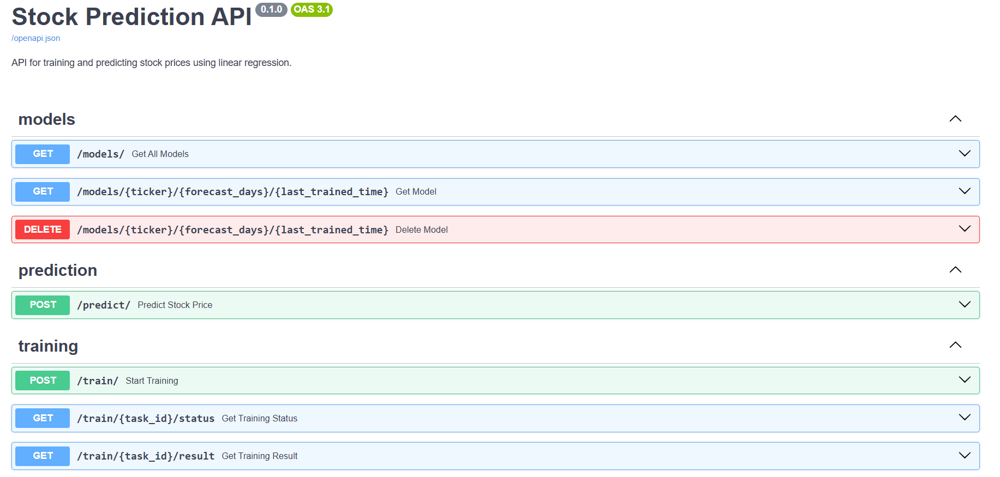

# Stock Price Predictor API

Modern web API to train, manage, and serve stock price prediction linear regression models. Leveraging the power of machine learning and cloud data, this API enables users to request predictions for future stock prices, trigger model training, and manage trained models—all through a simple and intuitive HTTP interface. Whether you're building trading tools, dashboards, or research applications, this API provides a fast and reliable backend for stock forecasting.

## Preview


## Stack

- **FastAPI**: High-performance Python web framework for building APIs.
- **Polars**: Lightning-fast DataFrame library for data manipulation.
- **scikit-learn**: Industry-standard machine learning library for model training.
- **Google BigQuery**: Cloud data warehouse for scalable stock data storage and retrieval.
- **Joblib**: Efficient serialization for model persistence.
- **Cachetools**: In-memory caching for fast repeated access.
- **pytest**: Comprehensive testing framework.

## Features

- **Train Models**: Trigger training of linear regression models for any supported stock ticker and forecast horizon.
- **Predict Prices**: Instantly get future price predictions for a given stock and forecast window.
- **Model Management**: List, retrieve, and delete trained models via API endpoints.
- **Caching**: Smart in-memory caching for predictions and model metadata to boost performance.
- **Background Tasks**: Asynchronous model training so your API stays responsive.
- **Validation**: Rigorous input validation and error handling for robust operation.
- **Cloud Integration**: Seamless data loading from Google BigQuery.

## Endpoints

- `POST /predict/`  
  Request price predictions for a stock and forecast horizon.

- `POST /train/`  
  Start training a new model for a given ticker and forecast days.

- `GET /train/{task_id}/status`  
  Check the status of a training task.

- `GET /train/{task_id}/result`  
  Retrieve the result of a completed training task.

- `GET /models/`  
  List all available trained models and their metrics.

- `GET /models/{ticker}/{forecast_days}/{last_trained_time}`  
  Retrieve metadata and metrics for a specific model.

- `DELETE /models/{ticker}/{forecast_days}/{last_trained_time}`  
  Delete a specific trained model.

## How to Install and Run

1. **Clone the repository**
   ```bash
   git clone https://github.com/yourusername/StockPricePredictorAPI.git
   cd StockPricePredictorAPI
   ```

2. **Set up environment variables**  
   Create `.env` file and fill in your Google Cloud credentials and configuration.

3. **Install dependencies**
   ```bash
   pip install -r requirements.txt
   ```

4. **Run the API**
   ```bash
   uvicorn app.main:app --host 0.0.0.0 --port 8000
   ```

5. **Access the documentation**  
   Visit [http://localhost:8000/docs](http://localhost:8000/docs) for the interactive Swagger UI.
