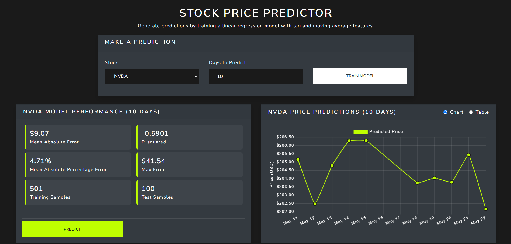

# Stock Price Predictor App

Modern web application to train, manage, and serve stock price prediction linear regression models. It combines a high-performance backend API with a lightweight interactive frontend demo, allowing users to request predictions, trigger asynchronous model training, and inspect performance metrics visually or directly via HTTP endpoints.

## Preview


## Stack

### Backend

- **FastAPI**: High-performance Python web framework for building APIs.
- **Polars**: Lightning-fast DataFrame library for data manipulation.
- **scikit-learn**: Industry-standard machine learning library for model training.
- **Google BigQuery**: Cloud data warehouse for scalable stock data storage and retrieval.
- **Joblib**: Efficient serialization for model persistence.
- **Cachetools**: In-memory caching for fast repeated access.
- **pytest**: Comprehensive testing framework.

### Frontend
- **Vanilla JavaScript**: Lightweight and dependency-free frontend for demo purposes.
- **Bootstrap & Bootswatch**: Responsive UI components and themes for a polished look.
- **Chart.js**: Interactive charting library for visualizing stock price predictions and model performance.

## Features

- **Interactive UI (Demo)**: Minimalist dashboard built with Vanilla JS to evaluate API capabilities visually.
- **Train Models**: Trigger training of linear regression models (using lag and moving average features) for supported tickers and forecast windows.
- **Model Metrics**: View evaluation metrics ($MAE$, $R^2$, $MAPE$, sample counts) immediately after model training.
- **Price Predictions**: Request future price forecasts and toggle between interactive time-series charts (Chart.js) or tabular data.
- **Caching & Async Tasks**: In-memory caching for model metrics and prediction results alongside background task handling for smooth responsiveness.
- **Cloud Integration**: Data loading directly from Google BigQuery.

## Endpoints

- `POST /predict/`  
  Request price predictions for a stock and forecast horizon.

- `POST /train/`  
  Start training a new model for a given ticker and forecast days.

- `GET /train/{task_id}/status`  
  Check the status of a training task.

- `GET /train/{task_id}/result`  
  Retrieve the result of a completed training task.

- `GET /models/`  
  List all available trained models and their metrics.

- `GET /models/{ticker}/{forecast_days}/{last_trained_time}`  
  Retrieve metadata and metrics for a specific model.

- `DELETE /models/{ticker}/{forecast_days}/{last_trained_time}`  
  Delete a specific trained model.

## Web UI Overview

The frontend serves as a functional client demo to test the API lifecycle:

- **Select & Train**: Pick a ticker symbol, set the prediction window (days), and click Train Model.
- **Review Performance**: Check accuracy metrics ($MAE$, $R^2$, sample counts) generated for the trained instance.
- **Visualize Forecasts**: Click Predict to view output data rendered dynamically as an interactive chart or a structured data table.

## How to Install and Run

1. **Clone the repository**
   ```bash
   git clone https://github.com/alfredomg20/StockPricePredictorApp.git
   cd StockPricePredictorApp
   ```

2. **Set up environment variables**  
   Create `.env` file and fill in your Google Cloud credentials and configuration.

3. **Install dependencies**
   ```bash
   pip install -r requirements.txt
   ```

4. **Start the server**
   ```bash
   uvicorn app.main:app --host 0.0.0.0 --port 8000
   ```

5. **Access the application**
   - Web UI: Open [http://localhost:8000](http://localhost:8000) in your browser.
   - API Documentation: Open [http://localhost:8000/docs](http://localhost:8000/docs) for the interactive Swagger UI.
